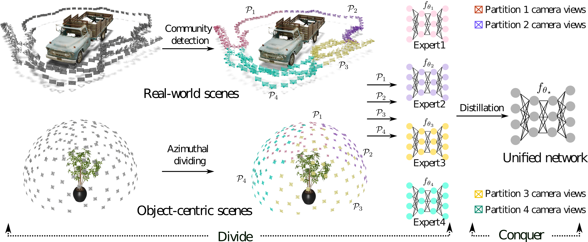

# Divide and Conquer: Rethinking the Training Paradigm of Neural Radiance Fields

## :imp:Introduction

This repository contains the code of the implementation of the ["Divide and Conquer: Rethinking the Training Paradigm of Neural Radiance Fields"](https://arxiv.org/abs/2401.16144). 





:feet:Neural radiance fields (NeRFs) have exhibited potential in synthesizing high-fidelity views of 3D scenes but the standard training paradigm of NeRF presupposes an equal importance for each image in the training set. This assumption poses a significant challenge for rendering specific views presenting intricate geometries, thereby resulting in suboptimal performance. In this paper, we take a closer look at the implications of the current training paradigm and redesign this for more superior rendering quality by NeRFs. Dividing input views into multiple groups based on their visual similarities and training individual models on each of these groups enables each model to specialize on specific regions without sacrificing speed or efficiency. Subsequently, the knowledge of these specialized models is aggregated into a single entity via a teacher-student distillation paradigm, enabling spatial efficiency for online rendering. Empirically, we evaluate our novel training framework on two publicly available datasets, namely NeRF synthetic and Tanks&Temples. Our evaluation demonstrates that our DaC training pipeline enhances the rendering quality of a state-of-the-art baseline model while exhibiting convergence to a superior minimum.


## :boom: Experiments

### Installation
Before conducting the experiments, you need to install the required libraries. We commend an anaconda environment with python >= 3.8. 

```bash
      conda create -n dac python=3.9 &&
      pip install -r requirements.txt
```


* The entire training pipeline is divided into 3 phases:

  1. Pretrain an expert given a split of dataset.
  2. Distil the knowledge of all the expert models into a unified model.
  3. Finetune the distilled model with training dataset.

  This repository contain the `bash` code for all the three phases.
  ```bash
        bash scripts/train_distil_ft.sh <scene_names>
  ```

  Alternatively, if you want to train the baseline model, what you can try is:

  ```bash
        bash scripts/train_N0.sh <scene_names>
  ```

  Further, if you have the expert models ready, and you only want to see what is happening during the distillation process, you can try:

  ```bash
        bash scripts/distillation.sh <scene_names>
  ```

* I will gradually polish this repository and add the files for splitting the scenes.


## Acknowledgement

The implementation of this work mostly inherits from [K-Planes](https://github.com/sarafridov/K-Planes). We sincerely thank the authors for their commitment to community.
